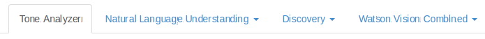
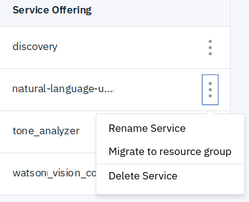
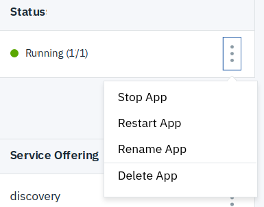

# Mailbox Analyzer

MailBox Analyzer is an application using [Watson Developer Cloud Java SDK](https://github.com/watson-developer-cloud/java-sdk) to demonstrate how to use the [Watson Developer Cloud services](https://www.ibm.com/watson/products-services/), a collection of REST APIs and SDKs that use cognitive computing to solve complex problems.

<br>

## Table of Contents

<!--
- [Overview of the application](#overview-of-the-application)
-->
- [Application Flow](#application-flow)
- [Prerequisite](#prerequisite)
  * [Install needed softwares](#install-needed-softwares)
  * [Check everything is installed properly](#check-everything-is-installed-properly)
  * [Check your IBM Cloud account](#check-your-ibm-cloud-account)
  * [Add some environment variables and aliases](#add-some-environment-variables-and-aliases)
- [Login to IBM Cloud](#login-to-ibm-cloud)
- [Setup environment](#setup-environment)
  * [Dump marketplace to get service name plan and description](#dump-marketplace-to-get-service-name-plan-and-description)
  * [Setup Tone Analyzer service](#setup-tone-analyzer-service)
    + [Get name and plan for Tone Analyzer service](#get-name-and-plan-for-tone-analyzer-service)
    + [Create Tone Analyzer service](#create-tone-analyzer-service)
    + [Create service key for Tone Analyzer service](#create-service-key-for-tone-analyzer-service)
  * [Setup Natural Language Understanding service](#setup-natural-language-understanding-service)
    + [Get name and plan for Natural Language Understanding service](#get-name-and-plan-for-natural-language-understanding-service)
    + [Create Natural Language Understanding service](#create-natural-language-understanding-service)
    + [Create service key for Natural Language Understanding service](#create-service-key-for-natural-language-understanding-service)
  * [Setup Discovery service](#setup-discovery-service)
    + [Get name and plan for Discovery service](#get-name-and-plan-for-discovery-service)
    + [Create Discovery service](#create-discovery-service)
    + [Create service key for Discovery service](#create-service-key-for-discovery-service)
  * [Create Discovery Collection](#create-discovery-collection)
      + [Store Discovery collection name in DSC_COLL_NAME environment variable](#store-discovery-collection-name-in-dsc_coll_name-environment-variable)
    + [Store Discovery collection language in DSC_COLL_LANG environment variable](#store-discovery-collection-language-in-dsc_coll_lang-environment-variable)
    + [Store Discovery version in DSC_VERSION environment variable](#store-discovery-version-in-dsc_version-environment-variable)
    + [Create collection coll0](#create-collection-coll0)
  * [Create Visual Recognition service](#create-visual-recognition-service)
    + [Get name and plan for Visual Recognition service](#get-name-and-plan-for-visual-recognition-service)
    + [Create Visual Recognition service](#create-visual-recognition-service)
    + [Create service key for Visual Recognition service](#create-service-key-for-visual-recognition-service)
  * [Check environment is setup correctly](#check-environment-is-setup-correctly)
- [Setup application](#setup-application)
  * [Get application code](#get-application-code)
  * [Prepare for application deployment](#prepare-for-application-deployment)
- [Deploy application](#deploy-application)
- [Run application](#run-application)
- [Send your own datas for analysis](#send-your-own-datas-for-analysis)
- [Clean your room](#clean-your-room)
- [About Watson Developer Cloud services being used in the application](#about-watson-developer-cloud-services-being-used-in-the-application)
- [About other Watson Developer Cloud services](#about-other-watson-developer-cloud-services)

<br>

<!--
### Overview of the application

A sample demo of the application with a mailbox analysis *may be* available [here](http://ma.bpshparis.eu-de.mybluemix.net).

<br>
-->

### Application Flow


<br>

### Prerequisite

<br>

#### Install needed softwares

> :bulb: Ctrl + Click on links below to open them in new tab and keep the tutorial tab opened.


* Download and install [IBM Cloud CLI](https://console.bluemix.net/docs/cli/reference/ibmcloud/download_cli.html)  
* Download and install [curl](https://curl.haxx.se/windows/)
* Download and install [jq](https://github.com/stedolan/jq/releases/download/jq-1.5/jq-win64.exe)


* Download and install [IBM Cloud CLI](https://console.bluemix.net/docs/cli/reference/ibmcloud/download_cli.html)  
* **curl** should already be installed. If not, get it from [here](https://curl.haxx.se/dlwiz/?type=bin&os=Mac+OS+X&flav=-&ver=-&cpu=i386)
* Download and install [jq](https://github.com/stedolan/jq/releases/download/jq-1.5/jq-osx-amd64)


* Download and install [IBM Cloud CLI](https://console.bluemix.net/docs/cli/reference/ibmcloud/download_cli.html)  
* Get **curl** from your distribution repository or download and install it from [here](https://curl.haxx.se/dlwiz/?type=bin&os=Linux).
* Get **jq** from your distribution repository or download and install it from [here](https://github.com/stedolan/jq/releases/download/jq-1.5/jq-linux64).

<br>

#### Check everything is installed properly

  

   

Check ibmcloud command is available:

	ibmcloud -v

Check curl command is available:

	curl -V

Check jq command is available:

	jq

<br>

#### Check your IBM Cloud account

Before being able to work with IBM Cloud you should be aware of **2** things:
  * the name of your **organization**, which is the same among all Regions (Germany, Sydney, United Kingdom, US South and US East).
  * the name of one **space** - which is assigned to one Region only - in one Region (Germany, Sydney, United Kingdom, US South and US East) in your organization.

> At least one organization has been created automatically, and one space called **dev** is created for you.
If not sure about organization name and if a space is available then log in [IBM Cloud console](https://console.bluemix.net/account/manage-orgs), click 'Cloud Foundry Orgs' then view details, check that 'Cloud Foundry Spaces in Region' is not empty and if so then Add a Cloud Foundry Space.

:checkered_flag: Now you should know both your organization and your space in one Region and your are ready to setup your environment in IBM Cloud.

<br>

#### Add some environment variables and aliases

:warning: **ORG**, **USERID** and **SPACE** have to be substituted with your own environment variables

  

Set your IBM Cloud Organization

	set "ORG=teatcher0@bpshparis.com"

Set your IBM Cloud userid
	
	set "USERID=teatcher0@bpshparis.com"

Set your IBM Cloud space

	set "SPACE=dev"	
	
Set usefull region and api endpoint

```
set "US_ENDPOINT=https://api.ng.bluemix.net"
set "GB_ENDPOINT=https://api.eu-gb.bluemix.net"
set "DE_ENDPOINT=https://api.eu-de.bluemix.net"
set "US_REGION=us-south"
set "GB_REGION=eu-gb"
set "DE_REGION=eu-de"
```

Add some aliases

```
set "iclus=C:\Progra~1\IBM\Cloud\bin\ibmcloud login -a %US_ENDPOINT% -u %USERID% --skip-ssl-validation -s %SPACE% -o %ORG%"
set "iclgb=C:\Progra~1\IBM\Cloud\bin\ibmcloud login -a %GB_ENDPOINT% -u %USERID% --skip-ssl-validation -s %SPACE% -o %ORG%" 
set "iclde=C:\Progra~1\IBM\Cloud\bin\ibmcloud login -a %DE_ENDPOINT% -u %USERID% --skip-ssl-validation -s %SPACE% -o %ORG%"
set "iclsso=C:\Progra~1\IBM\Cloud\bin\ibmcloud login -u %USERID% --sso" 
set "ic=C:\Progra~1\IBM\Cloud\bin\ibmcloud"
set "iclo=C:\Progra~1\IBM\Cloud\bin\ibmcloud logout"
```

:bulb: To display what's hiding behind aliases use **echo**

	echo %iclde%
	
will display

	C:\Progra~1\IBM\Cloud\bin\ibmcloud login -a https://api.eu-de.bluemix.net -u teatcher0@bpshparis.com --skip-ssl-validation -s dev -o teatcher0@bpshparis.com			


   

Set your IBM Cloud Organization

	export ORG=teatcher0@bpshparis.com

Set your IBM Cloud userid
	
	export USERID=teatcher0@bpshparis.com

Set your IBM Cloud space
	
	export SPACE=dev
	
Set usefull region and api endpoint
	
```
export US_ENDPOINT=https://api.ng.bluemix.net
export GB_ENDPOINT=https://api.eu-gb.bluemix.net
export DE_ENDPOINT=https://api.eu-de.bluemix.net
export US_REGION=us-south
export GB_REGION=eu-gb
export DE_REGION=eu-de
```


Add some aliases

```
alias iclus='/usr/local/bin/ibmcloud login -a ${US_ENDPOINT} -u ${USERID} --skip-ssl-validation -s ${SPACE} -o ${ORG}' 
alias iclgb='/usr/local/bin/ibmcloud login -a ${GB_ENDPOINT} -u ${USERID} --skip-ssl-validation -s ${SPACE} -o ${ORG}' 
alias iclde='/usr/local/bin/ibmcloud login -a ${DE_ENDPOINT} -u ${USERID} --skip-ssl-validation -s ${SPACE} -o ${ORG}' 
alias iclsso='/usr/local/bin/ibmcloud login -u ${USERID} --sso' 
alias ic='/usr/local/bin/ibmcloud'
alias iclo='/usr/local/bin/ibmcloud logout'
alias l='ls -Alhtr' 
```

:bulb: To display what's hiding behind aliases use **command -v**

	command -v iclde
	
will display

	alias iclde='/usr/local/bin/ibmcloud login -a https://api.eu-de.bluemix.net -u teatcher0@bpshparis.com --skip-ssl-validation -s dev -o teatcher0@bpshparis.com'			

<br>

### Login to IBM Cloud

:bulb: To avoid being prompt when using ibmcloud command set the following config parameters

	ibmcloud config --check-version false
	ibmcloud config --usage-stats-collect false

Let's connect to :de:

   

	iclde	
	
 

	%iclde%	

> :no_entry: If **login failed** because of logging in with a federated ID, then browse one of the following url:

> :bulb: Ctrl + Click on links below to open them in new tab and keep the tutorial tab opened.

 * https://login.ng.bluemix.net/UAALoginServerWAR/passcode
 * https://login.eu-gb.bluemix.net/UAALoginServerWAR/passcode
 * https://login.eu-de.bluemix.net/UAALoginServerWAR/passcode
 
> and get a one-time passcode.

> Then login with **--sso**,

   

	iclsso
	
 

	%iclsso%	
	
> paste the one-time passcode when prompt

	One Time Code (Get one at https://login.eu-gb.bluemix.net/UAALoginServerWAR/passcode)>
	
> and hit enter.

> Then create an API key called apikey0 and save it in apikey0 file in current directory
	
	ibmcloud iam api-key-create apikey0 -d "apikey0" --file apikey0

> Now login with your API key stored in apikey0 file in current directory

	ibmcloud login target --apikey @apikey0
	
> and target :de: endpoint

   

	ibmcloud target --cf-api ${DE_ENDPOINT} -o $ORG -s $SPACE
	
 	

	ibmcloud target --cf-api %DE_ENDPOINT% -o %ORG% -s %SPACE%

:thumbsup: Now you should be logged and ready to setup environment.

<br>


### Setup environment

#### Dump marketplace to get service name, plan and description

:zzz: It may take a minute to display 

   

	ibmcloud service offerings | tee marketplace

 	

	ibmcloud service offerings > marketplace

<br>

#### Setup Tone Analyzer service

 **Tone Analyzer** uses linguistic analysis to detect three types of tones from communications: emotion, social, and language.  This insight can then be used to drive high impact communications.

##### Get name and plan for Tone Analyzer service

   

	grep -i tone marketplace
	
 

	find /I "tone" marketplace

##### Create Tone Analyzer service
	ibmcloud service create tone_analyzer lite ta0

##### Create service key for Tone Analyzer service
	ibmcloud service key-create ta0 user0

<br>

#### Setup Natural Language Understanding

 **Natural Language Understanding** analyze text to extract meta-data from content such as concepts, entities, emotion, relations, sentiment and more.

##### Get name and plan for Natural Language Understanding service

   

	grep -i language marketplace

 

	find /I "language" marketplace

##### Create Natural Language Understanding service
	ibmcloud service create natural-language-understanding free nlu0

##### Create service key for Natural Language Understanding service
	ibmcloud service key-create nlu0 user0

<br>

#### Setup Discovery service

 **Discovery** add a cognitive search and content analytics engine to applications.

##### Get name and plan for Discovery service

   

	grep -i discovery marketplace

 

	find /I "discovery" marketplace

##### Create Discovery service

	ibmcloud service create discovery lite dsc0

##### Create service key for Discovery service

:warning: You may have to wait for service to display **create succeded** in **last operation** column before being able to create the key.

Check Discovery service have been created with 

	ibmcloud service list
	
When **last operation** column displays **create succeded** then create Discovery key 	

	ibmcloud service key-create dsc0 user0

#### Create Discovery Collection

##### Store Discovery Collection name in DSC_COLL_NAME environment variable

  

	export DSC_COLL_NAME=coll0

 

	set "DSC_COLL_NAME=coll0"

##### Store Discovery Collection language in DSC_COLL_LANG environment variable

> Choose a language model among this list:

> * **en**
> * es
> * de
> * ar
> * **fr**
> * it
> * ja
> * ko
> * pt
> * nl

  

	export DSC_COLL_LANG=en_us

 

	set "DSC_COLL_LANG=en_us"

##### Store Discovery Version in DSC_VERSION environment variable

  

	export DSC_VERSION=2018-03-05

 

	set "DSC_VERSION=2018-03-05"
	
##### Create collection coll0	

:checkered_flag: Now, you should be ready to create the collection.

  

Paste content below in a bat file e.g. run.sh
```
#!/bin/sh

export SVC_NAME=dsc0
export KEY_NAME=user0
export ENV_NAME=env0

echo DSC_COLL_LANG=$DSC_COLL_LANG
echo DSC_VERSION=$DSC_VERSION
echo DSC_COLL_NAME=$DSC_COLL_NAME

#Store Discovery url in URL environment variable
URL=$(ibmcloud service key-show $SVC_NAME $KEY_NAME | awk 'NR >= 4 {print}' | jq -r '.url') 
echo URL=$URL

#Store Discovery APIKEY in CRED environment variable
CRED=$(ibmcloud service key-show $SVC_NAME $KEY_NAME | awk 'NR >= 4 {print}' | jq -r '"apikey:" + .apikey')
echo CRED=$CRED

#Create env0 environment for Discovery service and store its id in ENVID
ENVID=$(curl  -X POST -u ${CRED} -H 'Content-Type: application/json' -d '{"name": "'$ENV_NAME'"}' ${URL}'/v1/environments?version='${DSC_VERSION} | jq -r '.environment_id')
echo ENVID=$ENVID

#Get configuration for Discovery service and store its id in CONFID
CONFID=$(curl -u ${CRED} ${URL}'/v1/environments/'${ENVID}'/configurations?version='${DSC_VERSION} | jq -r '.configurations[0].configuration_id')
echo CONFID=$CONFID

#Create collection for Discovery service and store its id in COLLID
COLLID=$(curl -X POST -H 'Content-Type: application/json' -u ${CRED} -d '{"name": "'$DSC_COLL_NAME'", "configuration_id":"'${CONFID}'" , "language": "'${DSC_COLL_LANG}'"}' ${URL}'/v1/environments/'${ENVID}'/collections?version='${DSC_VERSION} | jq -r '.collection_id')
echo COLLID=$COLLID
```

<!--
Get **environment_id** for Discovery service
	curl -u ${CRED} ${URL}'/v1/environments?version='${DSC_VERSION} | jq -r --arg ENV env0 '.environments[] | select(.name == $ENV) | .environment_id'
	curl -X POST -u ${CRED} -H 'Content-Type: application/json' -X DELETE ${URL}'/v1/environments/'${ENVID}'?version='${DSC_VERSION}
-->

<!--
Get **configuration_id** for Discovery service
	curl -u ${username}:${password} '${url}/v1/environments/${ENVID}/configurations?version=${DSC_VERSION}' | jq -r '.configurations[] | .configuration_id'
-->

 

Paste content below in a bat file e.g. run.bat

```
@echo off

setlocal ENABLEDELAYEDEXPANSION

set "SVC_NAME=dsc0"
set "KEY_NAME=user0"
set "ENV_NAME=env0"

@echo DSC_COLL_LANG=%DSC_COLL_LANG%
@echo DSC_VERSION=%DSC_VERSION%
@echo DSC_COLL_NAME=%DSC_COLL_NAME%

::Store credential in KEY environment variable
set "CMD=ibmcloud service key-show %SVC_NAME% %KEY_NAME%"
for /f "tokens=* skip=4" %%a in ('%CMD%') do (set LINE=%%a & set KEY=!KEY!!LINE!)

::Store Discovery url in URL environment variable
for /f "delims=" %%a in ('cmd /c "echo %KEY% | jq -r .url"') do set BASE_URL=%%a
@echo URL=%URL%

::Store Discovery APIKEY in CRED environment variable
for /f "delims=" %%a in ('cmd /c "echo %KEY% | jq -r .apikey"') do set APIKEY=%%a
set "CRED=apikey:%APIKEY%"
@echo %CRED%

::Create env0 environment for Discovery service and store its id in ENVID
set "URL=%BASE_URL%/v1/environments^?version^=%DSC_VERSION%"
set "PARMS={"name": "%ENV_NAME%"}"
echo %PARMS% > parms.json
set "CMD=curl  -X POST -u %CRED% -H "Content-Type: application/json" -d @parms.json %URL%"
for /f "tokens=*" %%a in ('cmd /c "%CMD%"') do (set LINE=%%a & set OUTPUT=!OUTPUT!!LINE!)
for /f "delims=" %%a in ('cmd /c "echo %OUTPUT% | jq -r .environment_id"') do set ENVID=%%a
@echo ENVID=%ENVID%

::Create configuration for Discovery service and store its id in CONFID
set "URL=%BASE_URL%/v1/environments/%ENVID%/configurations^?version^=%DSC_VERSION%"
set "CMD=curl -u %CRED% %URL%"
for /f "tokens=*" %%a in ('cmd /c "%CMD%"') do (set LINE=%%a & set OUTPUT=!OUTPUT!!LINE!)
for /f "delims=" %%a in ('cmd /c "echo %OUTPUT% | jq -r .configurations[0].configuration_id"') do set CONFID=%%a
@echo CONFID=%CONFID%

::Create collection for Discovery service and store its id in COLLID
set "PARMS={"name": "%DSC_COLL_NAME%", "configuration_id":"%CONFID%" , "language": "%DSC_COLL_LANG%"}"
echo %PARMS% > parms.json
set "URL=%BASE_URL%/v1/environments/%ENVID%/collections^?version^=%DSC_VERSION%"
set "CMD=curl -X POST -H "Content-Type: application/json" -u %CRED% -d @parms.json %URL%"
for /f "tokens=*" %%a in ('cmd /c "%CMD%"') do (set LINE=%%a & set OUTPUT=!OUTPUT!!LINE!)
for /f "delims=" %%a in ('cmd /c "echo %OUTPUT% | jq -r .collection_id"') do set COLLID=%%a
@echo COLLID=%COLLID%
```

and execute it to create Discovery collection

  

	chmod +x run.sh && ./run.sh

 

	run.bat

> :bulb: You won't need neither environment_id nor configuration_id for further use but keep ENV_NAME and DSC_COLL_NAME in mind if you choose something else than **env0** and **coll0**.

<br>

#### Create Visual Recognition service

 **Visual Recognition** find meaning in visual content! Analyze images for scenes, objects, faces, and other content. Choose a default model off the shelf, or create your own custom classifier. Develop smart applications that analyze the visual content of images or video frames to understand what is happening in a scene.

##### Get name and plan for Visual Recognition service

  

	grep -i visual marketplace
	
 

	find /I "visual" marketplace
	

##### Create Visual Recognition service

	ibmcloud resource service-instance-create wvc0 watson-vision-combined lite us-south	
	
	ibmcloud  resource service-alias-create wvc0 --instance-name wvc0

##### Create service key for Visual Recognition service

	ibmcloud service key-create wvc0 user0

<br>

#### Check environment is setup correctly

> :thumbsup: You are done with environment setup. Now at least four Watson services should be created (**ta0, nlu0, dsc0 and wvc0**) in your space.

>Check it with

	ibmcloud service list

<br>
	
### Setup application

#### Get application code

Download code

	curl -LO  https://github.com/bpshparis/ma/archive/master.zip

Unzip it

#### Prepare for application deployment

Change to code directory

	cd ma-master

> Now if you stand in the correct directory, you should be able to list directory such as **WebContent** and file such as **manifest.yml**.

>Before deploying the application you need to choose **3** things:

> :warning: **Don't use special characters. Use [a-z],[A-Z],[0-9] and [-] only.**
> * A **host** (must be unique in domain) for your application (e.g.: **mylastname-mycompagny**)
> * A **name** (must be unique in your space) for your application (e.g.: **myapp0**)
> * A **domain** (must be available in your space)  for your application (e.g.: **eu-de.mybluemix.net**)

:bulb: find domains available in your space with the following command

	ibmcloud app domains


Edit the **manifest.yml** and update it accordingly by substituting **mylastname-mycompagny**, **myapp0** and **eu-de.mybluemix.net** if needed:
```
applications:
# WARNING: Only hyphen (e.g. -) are supported in hostname. Don't add any dot.
# host must be unique in domain
- host: mylastname-mycompagny
  disk: 256M
  #name must be unique in your space
  name: myapp0
  path: ./WebContent
  #domain must be available in your space
  domain: eu-de.mybluemix.net
  mem: 256M
  instances: 1
  services:
  - ta0
  - nlu0
  - dsc0
  - wvc0
```

<br>

### Deploy application

> :warning: For deployment to work you need to push your code from the same directory as **manifest.yml**.

:checkered_flag: Now you are ready to deploy the application :

	ibmcloud app push

Once staging has completed you should be able to run the application *on your own IBM Cloud environment*.

```
...
0 of 1 instances running, 1 starting
1 of 1 instances running

App started


OK

App app0 was started using this command `.liberty/initial_startup.rb`

Showing health and status for app app0 in org teatcher0@bpshparis.com / space dev as teatcher0@bpshparis.com...
OK

requested state: started
instances: 1/1
usage: 1G x 1 instances
urls: ma-bpshparis.eu-de.mybluemix.net
last uploaded: Wed Oct 3 23:05:17 UTC 2018
stack: cflinuxfs2
buildpack: Liberty for Java(TM) (WAR, liberty-18.0.0_3, buildpack-v3.25-20180918-1034, ibmjdk-1.8.0_20180830, env)

     state     since                    cpu      memory        disk           details
#0   running   2018-10-03 11:07:38 PM   112.4%   96.6M of 1G   223.5M of 1G
```

<br>

### Run application

Display your application state :

	ibmcloud app list
	
Copy urls columns content. It should be something like **mylastname-mycompagny.eu-de.mybluemix.net**.

Paste it in a new tab of your web browser and check application is running

Click on  to upload sample attached documents in Discovery Collection and get sample mails.

Once mails are displayed, click  to send sample mails for analysis.

When Watson returned, **4 new tabs** (one per service) should appear and are ready to browse. 



<br>

### Send your own datas for analysis


Edit a json file of this form :

```
[
  {
    "subject": "paste some text between double quotation marks or set to null",
    "content": "paste some text between double quotation marks or set to null",
    "attached": "paste a doc|docx|pdf file name between double quotation marks or set to null",
    "picture": "paste a picture file name between double quotation marks or set to null",
    "face": "paste a picture file name between double quotation marks or set to null",
    "tip": "paste a picture file name between double quotation marks or set to null"
  }
]
```

An example for 2 mails with documents and pictures attached :

```
[
  {
      "subject": "At UEFA, Mounting Concern About A.C. Milan’s Murky Finances",
      "content": null,
      "attached": "3.pdf",
      "picture": "pic3.jpg",
      "face": null,
      "tip": null
  },
  {
      "subject": null,
      "content": "At a flea market six years ago, a North Carolina lawyer named Frank Abrams unknowingly bought...",
      "attached": "4.doc",
      "picture": null,
      "face": "face4.jpg",
      "tip": "tip4.jpg"
  }
]
```

Save this file as **mails.json** 

:bulb: Test it with jq

	jq . mails.json

The command should display pretty json without error.

Now **zip mails.json with all files set in attached, picture, face and tip fields from mails.json**.

:bulb: your archive should be this form

```
Archive:  mails0.zip
    testing: 3.doc                    OK
    testing: 3.pdf                    OK
    testing: 4.doc                    OK
    testing: face4.jpg                OK
    testing: mails.json               OK
    testing: pic3.jpg                 OK
    testing: tip4.jpg                 OK
No errors detected in compressed data of mails0.zip.
```
Now go back to your application and click  to upload your datas.

Once your datas have been upload, click on  to upload your attached documents in Discovery Collection and get your mails.

Once your mails are displayed, click  to send your mails for analysis.

<br>

### Clean your room

  

	export APP_NAME=app0 && for svc in ta0 nlu0 dsc0 wvc0; do ibmcloud service unbind ${APP_NAME} $svc; ibmcloud service key-delete -f $svc user0; ibmcloud service delete -f $svc; done && ic app delete ${APP_NAME} -f

 

Browse your [IBM Cloud dashboard](https://console.bluemix.net/dashboard/apps)

Open each services **More Actions** popup menu and choose **Delete Service**



Do the same for application. Open application **More Actions** popup menu and choose **Delete App**



<br>

### About Watson Developer Cloud services being used in the application

 **Tone Analyzer** uses linguistic analysis to detect three types of tones from communications: emotion, social, and language.  This insight can then be used to drive high impact communications.

[Documentation](https://console.bluemix.net/docs/services/tone-analyzer/getting-started.html) 
[Dashboard](https://www.ibm.com/watson/developercloud/dashboard/en/tone-analyzer-dashboard.html) 
[Github](https://github.com/watson-developer-cloud)

 **Natural Language Understanding** analyze text to extract meta-data from content such as concepts, entities, emotion, relations, sentiment and more.

[Documentation](https://console.bluemix.net/docs/services/natural-language-understanding/getting-started.html)
[Dashboard](https://www.ibm.com/watson/developercloud/dashboard/en/natural-language-understanding-dashboard.html)
[Github](https://github.com/watson-developer-cloud)

 **Discovery** add a cognitive search and content analytics engine to applications.

[Documentation](https://console.bluemix.net/docs/services/discovery/getting-started.html)
[Dashboard](https://www.ibm.com/watson/developercloud/dashboard/en/discovery-dashboard.html)
[Github](https://github.com/watson-developer-cloud)
[Tool](https://watson-discovery.bluemix.net)

 **Visual Recognition** find meaning in visual content! Analyze images for scenes, objects, faces, and other content. Choose a default model off the shelf, or create your own custom classifier. Develop smart applications that analyze the visual content of images or video frames to understand what is happening in a scene.

[Documentation](https://console.bluemix.net/docs/services/visual-recognition/getting-started.html)
[Dashboard](https://www.ibm.com/smarterplanet/us/en/ibmwatson/developercloud/dashboard/en/visual-recognition-dashboard.html)
[Github](https://github.com/watson-developer-cloud)
[Tool](https://watson-visual-recognition.ng.bluemix.net/)

<br>

### About other Watson Developer Cloud services

 **Speech to Text** Low-latency, streaming transcription.

[Documentation](https://console.bluemix.net/docs/services/speech-to-text/getting-started.html)
[Dashboard](https://www.ibm.com/watson/developercloud/dashboard/en/speech-to-text-dashboard.html)
[Github](https://github.com/watson-developer-cloud)

 **Text to Speech** Synthesizes natural-sounding speech from text.

[Documentation](https://console.bluemix.net/docs/services/text-to-speech/getting-started.html)
[Dashboard](https://www.ibm.com/watson/developercloud/dashboard/en/text-to-speech-dashboard.html)
[Github](https://github.com/watson-developer-cloud)

 **Language Translator** Translate text from one language to another for specific domains.

[Documentation](https://console.bluemix.net/docs/services/language-translator/getting-started.html)
[Dashboard](https://www.ibm.com/watson/developercloud/dashboard/en/language-translator-dashboard.html)
[Github](https://github.com/watson-developer-cloud)

 **Personality Insights** The Watson Personality Insights derives insights from transactional and social media data to identify psychological traits

[Documentation](https://console.bluemix.net/docs/services/personality-insights/getting-started.html)
[Dashboard](https://www.ibm.com/watson/developercloud/dashboard/en/personality-insights-dashboard.html)
[Github](https://github.com/watson-developer-cloud)

 **Conversation** Add a natural language interface to your application to automate interactions with your end users. Common applications include virtual agents and chat bots that can integrate and communicate on any channel or device. 

[Documentation](https://console.bluemix.net/docs/services/conversation/getting-started.html)
[Dashboard](https://www.ibm.com/watson/developercloud/dashboard/en/conversation-dashboard.html)
[Github](https://github.com/watson-developer-cloud)
[Tool](https://watson-conversation.ng.bluemix.net)

 **Natural Language Classifier** performs natural language classification on question texts. A user would be able to train their data and the predict the appropriate class for a input question.

[Documentation](https://console.bluemix.net/docs/services/natural-language-classifier/getting-started.html)
[Dashboard](https://www.ibm.com/watson/developercloud/dashboard/en/natural-language-classifier-dashboard.html)
[Github](https://github.com/watson-developer-cloud)
[Tool](https://natural-language-classifier-toolkit.eu-gb.bluemix.net)

